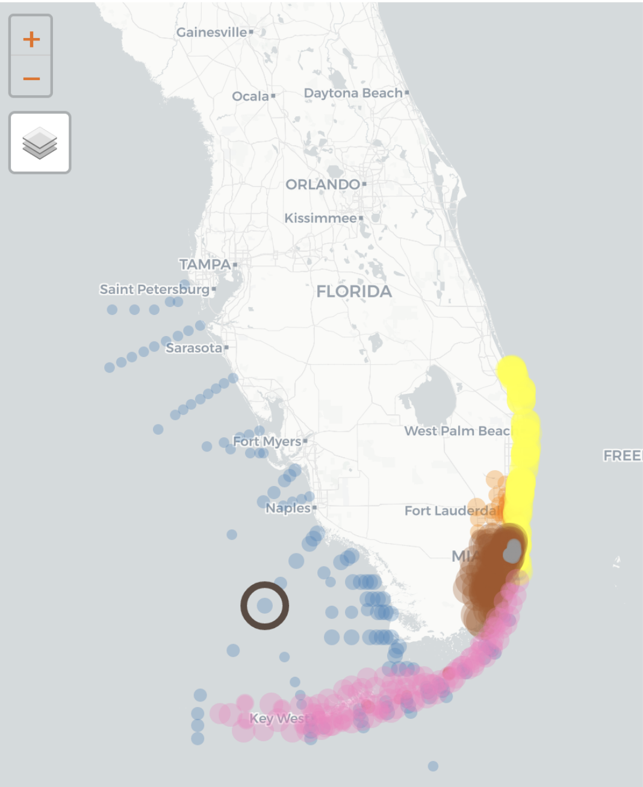

```{r setup, include=F}
knitr::opts_chunk$set(echo = F, message = F, warning = F)

library("flexdashboard")
library("mapview")
library("leaflet")
library("tidyverse")
library("shiny")
library("sf")
library("RColorBrewer")
library("extrafont")
library("plotly")
library("lubridate")
library("shinyWidgets")

# # style file
# styles <- readLines('https://raw.githubusercontent.com/tbep-tech/css-styling/master/styles.css')
# writeLines(styles, 'styles.css')

loadfonts(device = 'pdf', quiet = T)
if(Sys.info()[1] == 'Windows')
  loadfonts(device = 'win', quiet = T)

source('R/funcs.R')
source('R/data_loader.R')
```

```{r load data}
# === load data
epcdata <- load_wq_cleaned_df("data/df_cleaned.csv")

prj <- '+proj=longlat +ellps=WGS84 +datum=WGS84 +no_defs'
maxyr <- 2025

# TODO: data filters before showing on display
#       Dropdowns with 
#         * start & end date
#         * program
#         * current vs historical
#         * region (eg: fk reef traact)

# locations
# locs <- epcdata %>% 
#   select(epchc_station, Longitude, Latitude, bay_segment, Site) %>% 
#   unique %>% 
#   st_as_sf(coords = c('Longitude', 'Latitude'), crs = prj)

locs <- epcdata %>%
  group_by(epchc_station) %>%
  summarise(
    n_data = n(), .groups = 'drop',
    Latitude = mean(Latitude),
    Longitude = mean(Longitude),
    bay_segment = first(bay_segment),
    Site = first(Site)
  ) %>%
  st_as_sf(coords = c('Longitude', 'Latitude'), crs = prj)
```

```{r create download button}
downloadButtonRmd <- function (outputId, label = "Download", class = NULL, ...)  {
  tags$a(id = outputId, class = paste("btn btn-default shiny-download-link", 
                                      class), href = "", target = "_blank", download = NA, 
         icon("download"), label, ...)
}
```

```{r reactives}
# selected site plots
wq_plo <- reactive({
  # selected_site
  selsit <- input$map_marker_click$id

  # select 1st station if station not selected
  if(is.null(selsit))  
    selsit <- locs[1, ]$epchc_station 
  
  source('R/make_plot.R')

  selected_site <- filter(locs, epchc_station == selsit)[1,]  # TODO: mean the geometries instead of just using the first
  station_colname <- 'epchc_station'
  out <- subplot(
    make_plot(epcdata, 'Silica', 'Silica \n mg/L', station_colname, selsit),
    make_plot(epcdata, 'Chlorophyll a', 'Chlor-a \n ug/L', "epchc_station", selsit),
    make_plot(epcdata, 'Turbidity', 'Turbidity \n NTU', station_colname, selsit),
    # nrows must equal the number of make_plot() calls above
    nrows = 3,
    shareX = T, shareY = F, titleX = T, titleY = T, which_layout = 1

  ) %>% 
    rangeslider(thickness = 0.02) %>%  # TODO: disable rangeslider inset timeseries
    layout(
      title = selsit,
      legend = list(font = list(size = 16)), 
      font = list(family = fml),
      xaxis = list(
        domain = c(0.02, 1),
        rangeselector = list(
          buttons = list(
            list(step = "all"),
            list(
              count = 20,
              label = "20 yr",
              step = "year",
              stepmode = "backward"),
            list(
              count = 10,
              label = "10 yr",
              step = "year",
              stepmode = "backward"),
            list(
              count = 5,
              label = "5 yr",
              step = "year",
              stepmode = "backward"),
            list(
              count = 1,
              label = "1 yr",
              step = "year",
              stepmode = "backward")
          )
        )
      )
    ) %>% 
    plotly::config(
      toImageButtonOptions = list(
        format = "svg",
        filename = "myplot"
      )
    )
  return(out)
})
nitro_plo <- reactive({
  # selected_site
  selsit <- input$map_marker_click$id

  # select 1st station if station not selected
  if(is.null(selsit))  
    selsit <- locs[1, ]$epchc_station 
  
  source('R/make_plot.R')

  selected_site <- filter(locs, epchc_station == selsit)[1,]  # TODO: mean the geometries instead of just using the first
  station_colname <- 'epchc_station'
  out <- subplot(
    make_plot(epcdata, 'Ammonium (N)', 'Ammonium \n mg/L', "epchc_station", selsit),
    make_plot(epcdata, 'Nitrate-Nitrite (N)', 'mg/L', station_colname, selsit),
    make_plot(epcdata, 'Nitrite (N)', 'mg/L', station_colname, selsit),
    make_plot(epcdata, 'Nitrate (N)', 'mg/L', station_colname, selsit),
    make_plot(epcdata, 'Nitrogen- Total', 'Nitrogen \n mg N/L', station_colname, selsit),
    make_plot(epcdata, 'Nitrogen- Total Kjeldahl (P)', 'mg/L', station_colname, selsit),
    # nrows must equal the number of make_plot() calls above
    nrows = 6,
    shareX = T, shareY = F, titleX = T, titleY = T, which_layout = 1

  ) %>% 
    rangeslider(thickness = 0.02) %>%  # TODO: disable rangeslider inset timeseries
    layout(
      title = selsit,
      legend = list(font = list(size = 16)), 
      font = list(family = fml),
      xaxis = list(
        domain = c(0.02, 1),
        rangeselector = list(
          buttons = list(
            list(step = "all"),
            list(
              count = 20,
              label = "20 yr",
              step = "year",
              stepmode = "backward"),
            list(
              count = 10,
              label = "10 yr",
              step = "year",
              stepmode = "backward"),
            list(
              count = 5,
              label = "5 yr",
              step = "year",
              stepmode = "backward"),
            list(
              count = 1,
              label = "1 yr",
              step = "year",
              stepmode = "backward")
          )
        )
      )
    ) %>% 
    plotly::config(
      toImageButtonOptions = list(
        format = "svg",
        filename = "myplot"
      )
    )
  return(out)
})
phos_plo <- reactive({
  # selected_site
  selsit <- input$map_marker_click$id

  # select 1st station if station not selected
  if(is.null(selsit))  
    selsit <- locs[1, ]$epchc_station 
  
  source('R/make_plot.R')

  selected_site <- filter(locs, epchc_station == selsit)[1,]  # TODO: mean the geometries instead of just using the first
  station_colname <- 'epchc_station'
  out <- subplot(
    make_plot(epcdata, 'Orthophosphate (P)', 'Orthophosph. \n mg/L', station_colname, selsit),
    make_plot(epcdata, 'Phosphorus- Total', 'Phosphorus \n mg/L', station_colname, selsit),
    # nrows must equal the number of make_plot() calls above
    nrows = 2,
    shareX = T, shareY = F, titleX = T, titleY = T, which_layout = 1

  ) %>% 
    rangeslider(thickness = 0.02) %>%  # TODO: disable rangeslider inset timeseries
    layout(
      title = selsit,
      legend = list(font = list(size = 16)), 
      font = list(family = fml),
      xaxis = list(
        domain = c(0.02, 1),
        rangeselector = list(
          buttons = list(
            list(step = "all"),
            list(
              count = 20,
              label = "20 yr",
              step = "year",
              stepmode = "backward"),
            list(
              count = 10,
              label = "10 yr",
              step = "year",
              stepmode = "backward"),
            list(
              count = 5,
              label = "5 yr",
              step = "year",
              stepmode = "backward"),
            list(
              count = 1,
              label = "1 yr",
              step = "year",
              stepmode = "backward")
          )
        )
      )
    ) %>% 
    plotly::config(
      toImageButtonOptions = list(
        format = "svg",
        filename = "myplot"
      )
    )
  return(out)
})
```

```{r map}
# create colormap
locs$bay_segment <- factor(locs$bay_segment)
num_colors <- length(unique(locs$bay_segment))
# colors <- brewer.pal(n = num_colors, name = "Paired")
# colors <- c("#7FC97F", "#BEAED4", "#FFC088", "#FFFF99", "#3811FF", "#F00270","#BF5B17", "#660000")]
colors <- c(
  "#1111E3", "#1F78B4", "#B2DF8A", "#33A02C","#FB9A99","#E31A1C","#FDBF6F"
  ,"#FF7f00","#CAB2D6","#6A3D9A","#FFFF99","#A65628"
)
color_factor <- colorFactor(palette = colors, levels = unique(locs$bay_segment))

# TODO: add legend

bsmap <- mapview(locs, homebutton = F, legend = F) %>% 
  .@map %>% 
  leafem::removeMouseCoordinates() %>% 
  clearMarkers() %>%
  leaflet::addCircleMarkers(
    stroke = F,
    fillOpacity = 0.5,
    radius = ~scale(n_data, center = min(n_data), scale = max(n_data) - min(n_data)) * 10 + 4,
    data = locs, #filter(locs, bay_segment %in% c("DERM", "AOML")),
    layerId = ~epchc_station,
    color = ~color_factor(bay_segment),
    # TODO: add legend for marker colors
  ) %>% 
  addCircleMarkers(  # highlight the selected marker
      data = locs[1, ],
      layerId = 'selsit',
      stroke = T,
      color = '#5C4A42',
      fill = F,
      radius = 16, 
      opacity = 1
    )

# leaflet proxy for marker select
map <- leafletProxy('map')

observeEvent(input$map_marker_click, {
  
  selsit <- input$map_marker_click$id

  # get station selection
  selsitplo <- locs %>% 
    filter(epchc_station %in% selsit)

  # clear markers on input select, add all points and selected point
  map <- map %>% 
    removeMarker('selsit') %>% 
    addCircleMarkers(
      data = selsitplo,
      layerId = 'selsit',
      stroke = T,
      color = '#5C4A42',
      fill = F,
      radius = 16, 
      opacity = 1
    )
})
# TODO: add note RE size of circles correlated to number of data rows
```

```{r downloadhandlers}
# wq data
output$wqdwntab <- downloadHandler(
  filename = function(){'wqdat.csv'},
  content = function(file){
    
    # inputs
    seldl <- input$seldl
    
    todl <- epcdata %>% 
      filter(epchc_station %in% as.numeric(seldl)) %>% 
      select(bay_segment, epchc_station, SampleTime, yr, mo, Latitude, Longitude, chla)
    
    write.csv(todl, file, quote = T, row.names = F)
    
  }
)
```

SITE TRENDS
===========================================================

Column {.tabset .tabset-fade data-width=250}
-----------------------------------------------------------------------

### MAP SELECTION

```{r}
output$map <- renderLeaflet(bsmap)
leafletOutput('map')
```

### About This Page

**Welcome to the Florida’s Coral Reef Unified Water Quality Data Visualization Tool.**

This page shows time series for a suite of parameters compiled in the Florida’s Coral Reef
Unified Water Quality Database. 
Station locations are shown in colors which signify the data provider at that location.
The points on the map are sized proportionally to the amount of data points at that location. 

**Data are collected by the following data providers:**

* NOAA Atlantic Oceanographic and Meteorological Laboratory (AOML - blue)
* FIU Southeast Environmental Research Center (SERC - pink)
* MDC Department of Environmental Resource Management (DERM - brown)
* Florida Department of Environmental Protection (FDEP - yellow)
* Broward County (BC - orange)
* City of Miami Beach (MB - gray)
* Biscayne Bay Aquatic Preserve (BBAP - green)
* Palm Beach County (PBC)

The following water quality parameters are collected and shown as time series. Note that not all
data providers collect all listed parameters.

Nitrogen

* Total Nitrogen (TN)
* Nitrite (NO2)
* Nitrate (NO3)
* Nitrate – Nitrite (N) ???
* Ammonium (NH4)
* Total Kjeldahl Nitrogen (TKN)

Phosphorus

* Total Phosphorus (TP)
* Orthophosphates (OPO4)

Water Clarity

* Chlorophyll-a
* Turbidity
* Silicates

**How to use this tool:**

Begin by selecting a sampling location on the map. To see station locations, you can move
around using your mouse and zoom into the map. Once a location is selected, that station will be
outlined in brown:

<br>
```{r, fig.align='center', out.width='100%'}

```
<br>

A series of plots will appear on the right after a station is selected. Above the plots, the title
indicates the data provider and the sampling location separated by a period. The plots show time
series of sampled parameters at that location. Mouse over any plot to see individual values. The
plots are linked and the x-axis can be adjusted to zoom in on a time period of interest. To adjust
time ranges on the x-axis, click on any plot and drag the mouse pointer over the desired time
range. The plot on the very bottom is a reference for the relative zoom on the x-axis. Time ranges
can also be adjusted with the sliders at each end of this plot.


Column {.tabset .tabset-fade data-width=500}
-----------------------------------------------------------------------

### Water Clarity

```{r}
output$wq_plo <- renderPlotly(wq_plo())
plotlyOutput('wq_plo')
```

### Nitrogen

```{r}
output$nitro_plo <- renderPlotly(nitro_plo())
plotlyOutput('nitro_plo')
```

### Phosphorus

```{r}
output$phos_plo <- renderPlotly(phos_plo())
plotlyOutput('phos_plo')
```