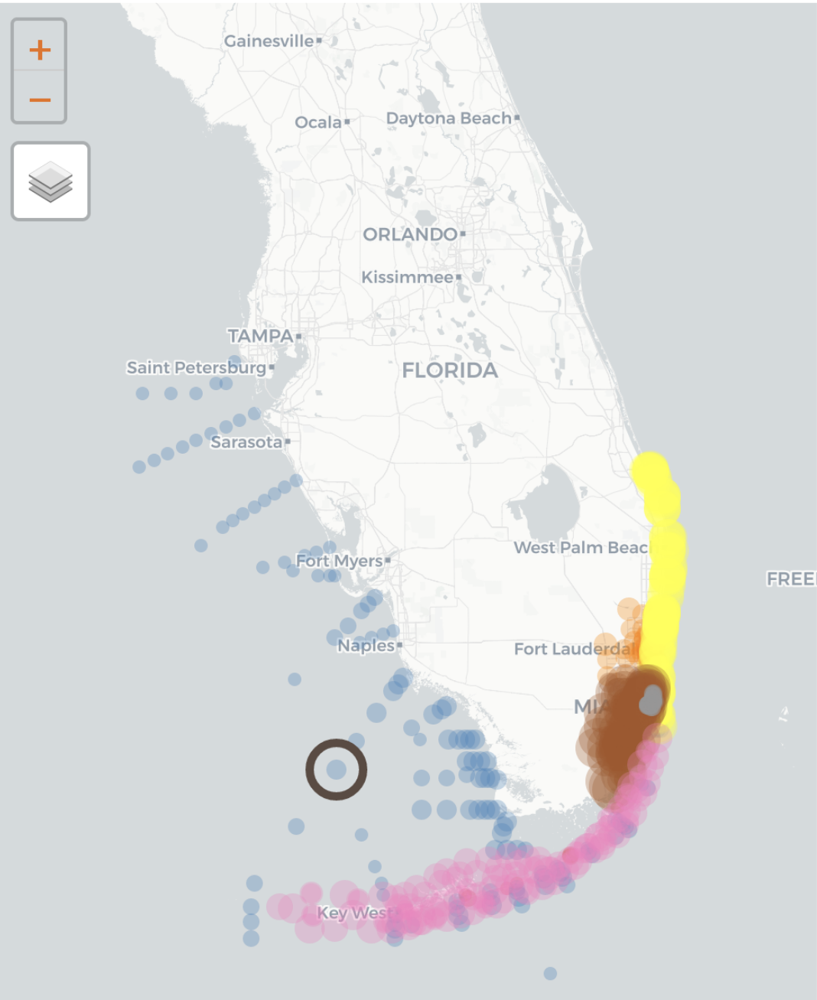

```{r setup, include=F}
knitr::opts_chunk$set(echo = F, message = F, warning = F)

library("flexdashboard")
library("mapview")
library("leaflet")
library("tidyverse")
library("shiny")
library("sf")
library("RColorBrewer")
library("extrafont")
library("plotly")
library("lubridate")
library("shinyWidgets")

# # style file
# styles <- readLines('https://raw.githubusercontent.com/tbep-tech/css-styling/master/styles.css')
# writeLines(styles, 'styles.css')

loadfonts(device = 'pdf', quiet = T)
if(Sys.info()[1] == 'Windows')
  loadfonts(device = 'win', quiet = T)

source('R/funcs.R')
source('R/data_loader.R')
source('R/make_plot.R')
source('listOfStationFiles.R')
```

```{r load data}
prj <- '+proj=longlat +ellps=WGS84 +datum=WGS84 +no_defs'

# === load station metadata from dashboardStations
stations_metadata <- load_dashboard_stations(here::here("data/dashboardStations.csv"))

# Create locations dataframe for mapping
locs <- stations_metadata %>%
  st_as_sf(coords = c('Longitude', 'Latitude'), crs = prj)

# === parameter mapping from dashboardStations columns to dashboard parameter names
# Map dashboardStations column names to dashboard parameter names
param_mapping <- list(
  "Ammonium (NH4)" = "Ammonium",
  "Chlorophyll a, Corrected for Pheophytin" = "Chlorophyll a",
  "NO2+3, Filtered" = "Nitrate+Nitrite",
  "Phosphate, Filtered (PO4)" = "Orthophosphate",
  "Salinity" = "Salinity",
  "Water Temperature" = "Water Temperature",
  "pH" = "pH",
  "Dissolved Oxygen" = "Dissolved Oxygen",
  "Total Ammonia (N)" = "Ammonia (N)",
  "Total Kjeldahl Nitrogen" = "Total Kjeldahl Nitrogen",
  "Total Nitrogen" = "Total Nitrogen",
  "Total Phosphorus" = "Total Phosphorus",
  "Turbidity" = "Turbidity",
  "Nitrate (NO3)" = "Nitrate",
  "Nitrite (NO2)" = "Nitrite"
)
param_mapping_flipped <- list()
# swap keys and values for the param_mapping
for(key in names(param_mapping)) {
  param_mapping_flipped[[param_mapping[[key]]]] <- key
}


# Get available parameters from dashboardStations columns
available_params <- names(param_mapping)[names(param_mapping) %in% names(stations_metadata)]
dashboard_param_names <- unlist(param_mapping[available_params])
```

```{r create download button}
downloadButtonRmd <- function (outputId, label = "Download", class = NULL, ...)  {
  tags$a(id = outputId, class = paste("btn btn-default shiny-download-link", 
                                      class), href = "", target = "_blank", download = NA, 
         icon("download"), label, ...)
}
```

```{r reactives}
# === Station data loading
# Load station-specific data when a station is selected
station_data <- reactive({
  # Get selected station ID
  selsit <- input$map_marker_click$id
  
  # Use first station if none selected
  if(is.null(selsit))  
    selsit <- locs[1, ]$epchc_station 
  
  # Parse the station ID to extract program name and location ID
  # Format: "ProgramName.LocationID"
  station_parts <- strsplit(selsit, "\\.")[[1]]
  if(length(station_parts) >= 2) {
    program_name <- station_parts[1]
    location_id <- station_parts[2]

    print(paste("loading data for", program_name, location_id, "..."))

    # Load station-specific data
    load_station_data(program_name, location_id)
  } else {
    # Show notification with error message
    showNotification("Invalid station ID format", type = "error")
  }
})

# === selected site plots
wq_plo <- reactive({
  # Get selected station ID
  selsit <- input$map_marker_click$id

  # Use first station if none selected
  if(is.null(selsit))  
    selsit <- locs[1, ]$epchc_station 

  # Get station-specific data
  current_station_data <- station_data()
  
  selected_site <- filter(locs, epchc_station == selsit)[1,]  # TODO: mean the geometries instead of just using the first
  out <- subplot(
    make_plot(current_station_data, 'Chlorophyll a', 'Chlor-a \n ug/L', selsit),
    make_plot(current_station_data, 'Turbidity', 'Turbidity \n NTU', selsit),
    make_plot(current_station_data, 'Dissolved Oxygen', 'Dissolved Oxygen', selsit),

    # nrows must equal the number of make_plot() calls above
    nrows = 3,
    shareX = T, shareY = F, titleX = T, titleY = T, which_layout = 1

  ) %>% 
    rangeslider(thickness = 0.02) %>%  # TODO: disable rangeslider inset timeseries
    layout(
      title = selsit,
      legend = list(font = list(size = 16)), 
      font = list(family = fml),
      xaxis = list(
        domain = c(0.02, 1),
        rangeselector = list(
          buttons = list(
            list(step = "all"),
            list(
              count = 20,
              label = "20 yr",
              step = "year",
              stepmode = "backward"),
            list(
              count = 10,
              label = "10 yr",
              step = "year",
              stepmode = "backward"),
            list(
              count = 5,
              label = "5 yr",
              step = "year",
              stepmode = "backward"),
            list(
              count = 1,
              label = "1 yr",
              step = "year",
              stepmode = "backward")
          )
        )
      )
    ) %>% 
    plotly::config(
      toImageButtonOptions = list(
        format = "svg",
        filename = "myplot"
      )
    )
  return(out)
})
phys_plo <- reactive({
  # Get selected station ID
  selsit <- input$map_marker_click$id

  # Use first station if none selected
  if(is.null(selsit))  
    selsit <- locs[1, ]$epchc_station 

  # Get station-specific data
  current_station_data <- station_data()

  selected_site <- filter(locs, epchc_station == selsit)[1,]  # TODO: mean the geometries instead of just using the first
  out <- subplot(
    make_plot(current_station_data, 'Salinity', 'Salinity', selsit),
    make_plot(current_station_data, 'Water Temperature', 'Water Temperature \n deg C', selsit),
    make_plot(current_station_data, 'pH', 'pH', selsit),

    # nrows must equal the number of make_plot() calls above
    nrows = 3,
    shareX = T, shareY = F, titleX = T, titleY = T, which_layout = 1

  ) %>% 
    rangeslider(thickness = 0.02) %>%  # TODO: disable rangeslider inset timeseries
    layout(
      title = selsit,
      legend = list(font = list(size = 16)), 
      font = list(family = fml),
      xaxis = list(
        domain = c(0.02, 1),
        rangeselector = list(
          buttons = list(
            list(step = "all"),
            list(
              count = 20,
              label = "20 yr",
              step = "year",
              stepmode = "backward"),
            list(
              count = 10,
              label = "10 yr",
              step = "year",
              stepmode = "backward"),
            list(
              count = 5,
              label = "5 yr",
              step = "year",
              stepmode = "backward"),
            list(
              count = 1,
              label = "1 yr",
              step = "year",
              stepmode = "backward")
          )
        )
      )
    ) %>% 
    plotly::config(
      toImageButtonOptions = list(
        format = "svg",
        filename = "myplot"
      )
    )
  return(out)
})
nitro_plo <- reactive({
  # Get selected station ID
  selsit <- input$map_marker_click$id

  # Use first station if none selected
  if(is.null(selsit))  
    selsit <- locs[1, ]$epchc_station 

  # Get station-specific data
  current_station_data <- station_data()

  selected_site <- filter(locs, epchc_station == selsit)[1,]  # TODO: mean the geometries instead of just using the first
  station_colname <- 'epchc_station'
  out <- subplot(
    make_plot(current_station_data, 'Ammonium', 'Ammonium \n mg/L', selsit),
    # make_plot(current_station_data, 'NO2+3, Filtered', 'mg/L', selsit),
    # make_plot(current_station_data, 'Nitrite', 'mg/L', selsit),
    # make_plot(current_station_data, 'Nitrate', 'mg/L', selsit),
    make_plot(current_station_data, 'Total Nitrogen', 'Nitrogen \n mg N/L', selsit),
    make_plot(current_station_data, 'Total Kjeldahl Nitrogen', 'Kjeldahl N mg/L', selsit),
    # nrows must equal the number of make_plot() calls above
    nrows = 3,
    shareX = T, shareY = F, titleX = T, titleY = T, which_layout = 1

  ) %>% 
    rangeslider(thickness = 0.02) %>%  # TODO: disable rangeslider inset timeseries
    layout(
      title = selsit,
      legend = list(font = list(size = 16)), 
      font = list(family = fml),
      xaxis = list(
        domain = c(0.02, 1),
        rangeselector = list(
          buttons = list(
            list(step = "all"),
            list(
              count = 20,
              label = "20 yr",
              step = "year",
              stepmode = "backward"),
            list(
              count = 10,
              label = "10 yr",
              step = "year",
              stepmode = "backward"),
            list(
              count = 5,
              label = "5 yr",
              step = "year",
              stepmode = "backward"),
            list(
              count = 1,
              label = "1 yr",
              step = "year",
              stepmode = "backward")
          )
        )
      )
    ) %>% 
    plotly::config(
      toImageButtonOptions = list(
        format = "svg",
        filename = "myplot"
      )
    )
  return(out)
})
phos_plo <- reactive({
  # Get selected station ID
  selsit <- input$map_marker_click$id

  # Use first station if none selected
  if(is.null(selsit))  
    selsit <- locs[1, ]$epchc_station 

  # Get station-specific data
  current_station_data <- station_data()

  selected_site <- filter(locs, epchc_station == selsit)[1,]  # TODO: mean the geometries instead of just using the first
  station_colname <- 'epchc_station'
  out <- subplot(
    make_plot(current_station_data, 'Orthophosphate', 'Phosphate \n mg/L', selsit),
    make_plot(current_station_data, 'Total Phosphorus', 'Phosphorus \n mg/L', selsit),
    # nrows must equal the number of make_plot() calls above
    nrows = 2,
    shareX = T, shareY = F, titleX = T, titleY = T, which_layout = 1

  ) %>% 
    rangeslider(thickness = 0.02) %>%  # TODO: disable rangeslider inset timeseries
    layout(
      title = selsit,
      legend = list(font = list(size = 16)), 
      font = list(family = fml),
      xaxis = list(
        domain = c(0.02, 1),
        rangeselector = list(
          buttons = list(
            list(step = "all"),
            list(
              count = 20,
              label = "20 yr",
              step = "year",
              stepmode = "backward"),
            list(
              count = 10,
              label = "10 yr",
              step = "year",
              stepmode = "backward"),
            list(
              count = 5,
              label = "5 yr",
              step = "year",
              stepmode = "backward"),
            list(
              count = 1,
              label = "1 yr",
              step = "year",
              stepmode = "backward")
          )
        )
      )
    ) %>% 
    plotly::config(
      toImageButtonOptions = list(
        format = "svg",
        filename = "myplot"
      )
    )
  return(out)
})
```

```{r map}
# create colormap
locs$bay_segment <- factor(locs$ProgramName)
num_colors <- length(unique(locs$bay_segment))
# colors <- brewer.pal(n = num_colors, name = "Paired")
# colors <- c("#7FC97F", "#BEAED4", "#FFC088", "#FFFF99", "#3811FF", "#F00270","#BF5B17", "#660000")]
colors <- c(
  "#1111E3", "#1F78B4", "#B2DF8A", "#33A02C","#FB9A99","#E31A1C","#FDBF6F"
  ,"#FF7f00","#CAB2D6","#6A3D9A","#FFFF99","#A65628"
)
color_factor <- colorFactor(palette = colors, levels = unique(locs$bay_segment))

# TODO: add legend

createMapMarkers <- function(map_obj, station_data){
  if(nrow(station_data) == 0){
    return(map_obj %>% clearMarkers())
  }
  
  # Add bay_segment column from locs for coloring
  station_data$bay_segment <- factor(station_data$ProgramName)
  
  map_obj %>%
    clearMarkers() %>%
    addCircleMarkers(
      stroke = F,
      fillOpacity = 0.5,
      radius = 5,
      data = station_data,
      layerId = ~epchc_station,
      color = ~color_factor(bay_segment),
      # TODO: add legend for marker colors
    ) %>% 
    addCircleMarkers(  # highlight the selected marker
        data = station_data[1, ],
        layerId = 'selsit',
        stroke = T,
        color = '#5C4A42',
        fill = F,
        radius = 16, 
        opacity = 1
      )
}

bsmap <- mapview(locs, homebutton = F, legend = F) %>% 
  .@map %>% 
  leafem::removeMouseCoordinates() %>% 
  createMapMarkers(locs)

# leaflet proxy for marker select
map <- leafletProxy('map')

observeEvent(input$map_marker_click, {
  
  selsit <- input$map_marker_click$id

  # get station selection
  selsitplo <- locs %>% 
    filter(epchc_station %in% selsit)

  # clear markers on input select, add all points and selected point
  map <- map %>% 
    removeMarker('selsit') %>% 
    addCircleMarkers(
      data = selsitplo,
      layerId = 'selsit',
      stroke = T,
      color = '#5C4A42',
      fill = F,
      radius = 16, 
      opacity = 1
    )
})
# TODO: add note RE size of circles correlated to number of data rows
```

```{r downloadhandlers}
# wq data
output$wqdwntab <- downloadHandler(
  filename = function(){'wqdat.csv'},
  content = function(file){
    
    # inputs
    seldl <- input$seldl
    
    todl <- station_data()
    
    write.csv(todl, file, quote = T, row.names = F)
  }
)
```

SITE TRENDS
===========================================================

Column {.tabset .tabset-fade data-width=250}
-----------------------------------------------------------------------

### MAP SELECTION

```{r}
output$map <- renderLeaflet(bsmap)
leafletOutput('map')
```

### About This Page

**Welcome to the Florida’s Coral Reef Unified Water Quality Data Visualization Tool.**

This page shows time series for a suite of parameters compiled in the Florida’s Coral Reef
Unified Water Quality Database. 
Station locations are shown in colors which signify the data provider at that location.
The points on the map are sized proportionally to the amount of data points at that location. 

**How to use this tool:**

Begin by selecting a sampling location on the map. To see station locations, you can move
around using your mouse and zoom into the map. Once a location is selected, that station will be
outlined in brown:

<br>
```{r, fig.align='center', out.width='100%'}

```
<br>

A series of plots will appear on the right after a station is selected. Above the plots, the title
indicates the data provider and the sampling location separated by a period. The plots show time
series of sampled parameters at that location. Mouse over any plot to see individual values. The
plots are linked and the x-axis can be adjusted to zoom in on a time period of interest. To adjust
time ranges on the x-axis, click on any plot and drag the mouse pointer over the desired time
range. The plot on the very bottom is a reference for the relative zoom on the x-axis. Time ranges
can also be adjusted with the sliders at each end of this plot.


Column {.tabset .tabset-fade data-width=500}
-----------------------------------------------------------------------

### Water Clarity

```{r}
output$wq_plo <- renderPlotly(wq_plo())
plotlyOutput('wq_plo')
```

### Physical Parameters

```{r}
output$phys_plo <- renderPlotly(phys_plo())
plotlyOutput('phys_plo')
```

### Nitrogen

```{r}
output$nitro_plo <- renderPlotly(nitro_plo())
plotlyOutput('nitro_plo')
```

### Phosphorus

```{r}
output$phos_plo <- renderPlotly(phos_plo())
plotlyOutput('phos_plo')
```

### Site Map Filtering
Use these dropdowns to limit the display of stations shown on the map.

```{r}
# === filter stations by available parameters
# create multi-select menu 
# populated by available parameters from dashboardStations
# all checked by default

pickerInput(
  inputId = "param_select",
  label = "Select Water Quality Parameters:",
  choices = sort(dashboard_param_names),
  selected = sort(dashboard_param_names),
  multiple = TRUE,
  options = list(
    `actions-box` = TRUE,
    `selected-text-format` = "count > 3"
  )
)

# on modification of multi-select,
# 1. filter stations for selected parameters
# 2. update map

# master reactive data object - filters stations based on selected parameters
master_filtered_data <- reactive({
  req(input$param_select)
  if(is.null(input$param_select) || length(input$param_select) == 0){
    return(NULL)
  }
  
  filtered_stations_data <- stations_metadata %>% mutate(
    nRowsSelected = 0
  )
  # print(filtered_stations_data)

  for(param in input$param_select) {
    mappedParam <- param_mapping_flipped[[param]]
    # print(paste('adding stations with', mappedParam, '...'))
    # print(filtered_stations_data[[mappedParam]])
    
    filtered_stations_data <- filtered_stations_data %>%
      mutate(
        nRowsSelected = nRowsSelected + .data[[mappedParam]]
      )
  }

  # drop any stations with nRowsSelected <= 0
  filtered_stations_data <- filtered_stations_data %>% filter(nRowsSelected > 0)
  # print(filtered_stations_data$nRowsSelected)

  return(filtered_stations_data)
})

# reactive expression for provider counts - uses master data
provider_counts <- reactive({
  req(master_filtered_data())
  if(is.null(master_filtered_data())){
    return("No parameters selected")
  }
  
  counts <- master_filtered_data() %>%
    group_by(ProgramName) %>%
    summarise(n = n(), .groups = 'drop') %>%
    arrange(desc(n))
  
  if(nrow(counts) == 0){
    return("No data matches selection")
  }
  
  paste(counts$ProgramName, ":", counts$n, collapse = "\n\n")
})

# observer to update map when parameter selection changes
observe({
  param_select <- input$param_select
  print(paste("param_select:", length(param_select), "items"))
  if(is.null(param_select) || length(param_select) == 0){
    print("Clearing all markers")
    leafletProxy('map') %>% clearMarkers()
  } else {
    print("Updating with filtered stations")
    leafletProxy('map') %>%
      createMapMarkers(master_filtered_data())
  }
  
  # Explicit cleanup
  rm(list = ls(envir = .GlobalEnv)[grepl("^tmp_", ls(envir = .GlobalEnv))])
  gc(verbose = FALSE)
})

```
------------------------------------------
#### Number of Data Points in Selection:
```{r}
# bar chart output for provider counts
output$provider_summary <- renderPlotly({
  req(master_filtered_data())
  if(is.null(master_filtered_data())){
    return(ggplot() + theme_void() + 
            annotate("text", x = 0.5, y = 0.5, label = "No parameters selected", 
                    size = 6, hjust = 0.5, vjust = 0.5))
  }
  
  counts <- master_filtered_data() %>%
    group_by(ProgramName) %>%
    summarise(n = n(), .groups = 'drop') %>%
    arrange(desc(n))
  
  if(nrow(counts) == 0){
    return(ggplot() + theme_void() + 
            annotate("text", x = 0.5, y = 0.5, label = "No data matches selection", 
                    size = 6, hjust = 0.5, vjust = 0.5))
  }
  
  p <- ggplot(counts, aes(x = reorder(ProgramName, n), y = n, fill = ProgramName)) +
    geom_col() +
    coord_flip() +
    labs(
      title = "Data Points by Provider",
      x = "Provider",
      y = "Number of Data Points"
    ) +
    theme_minimal() +
    theme(
      legend.position = "none",
      axis.text.x = element_text(angle = 45, hjust = 1)
    )
  
  ggplotly(p, dynamicTicks = FALSE)
})
```

```{r}
plotlyOutput('provider_summary')
```

